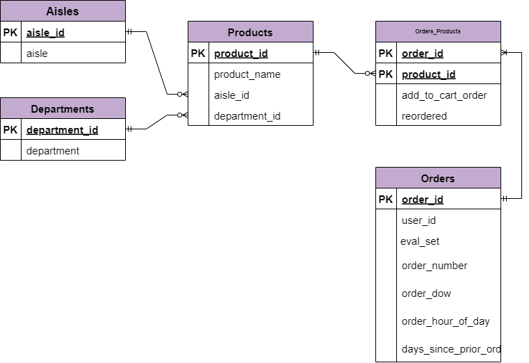
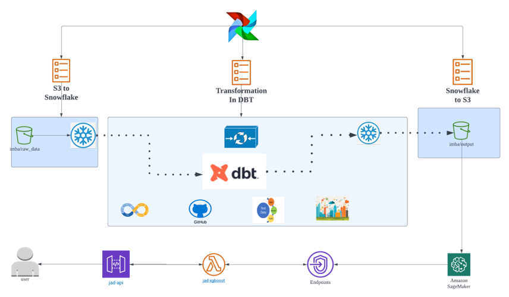

### Introduction of Project
#### 1.Background
Instacart is a grocery order and delivery app, which is similar to Coles or Woolworth order and delivery app in Australia. Over 3 million grocery orders from more than 200, 000 customers were provided by Instacart as open-sourced data. However, the salesman of Instacart recommends products in traditional ways or, that is to say, manually. They have not made good use of the huge amount of valuable transactional records yet. By taking advantage to analyse an ample amount of data, Instacart would predict well customer purchasing behaviour and pattern, which would strongly enhance their competitiveness.

#### 2.Purpose
This project intends to build an automated pipeline to extract, load and tranform raw data and to store curated data in data warehouse.

#### 3.Data
The dataset is provided as-is for non-commercial use, and can be downloaded from S3 at: https://www.instacart.com/datasets/grocery-shopping-2017 and is subject to Instacart Terms and Conditions.

#### 4.Plan
This project builds a data lake in AWS S3, uses snowflake as data warehouse, and transforms raw data using dbt.

#### 5.Techniques
- Data Modelling: Relational Model
- Data Lake: AWS S3
- Data Warehouse: Snowflake
- ELT tool: dbt
- Version Control: Git, GitHub, dbt
- Workflow monitoring: Apache Airflow

#### 6.Data Modelling

#### 7.Data Pipeline
